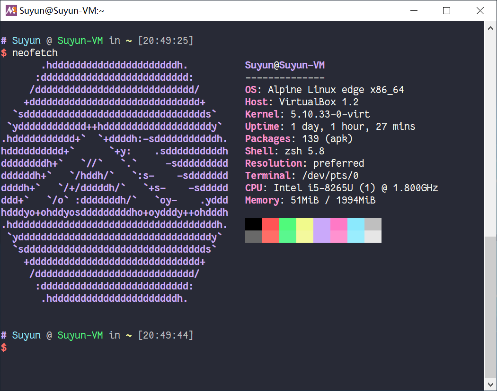

本文旨在提供一个构建以 Windows 10 Enterprise LTSC x64 为宿主机，以 VirtualBox 为驱动，拥有 Apline Linux x64 虚拟机的双子系统环境的安装指南。

<!--more-->

> 本文在很大程度上参考了 [Equim](https://ekyu.moe/) 的 [双子系统(仮)环境安装指南](https://ekyu.moe/article/futago-system-kari-setup-guide/)（使用 [CC-BY-NC 4.0](https://creativecommons.org/licenses/by-nc/4.0/deed.zh-Hans) 协议）。在此感谢 Equim。

# 关于双子系统

双子系统的宗旨是尽可能使得姐姐机（Windows 10）和妹妹机（Apline Linux in VirtualBox）能较为无缝的集成在一起，以此让 Windows 和 Linux 都扬长避短，最大化各自的优点。

## 优点

1. 扬长避短：同时体验 Windows 优秀的图形界面和软件生态，与 Linux 对 Dev 和 Ops 的天生优势。
2. 安全快捷：姐姐机可以通过 NAT 保护妹妹机；也可以通过 VM 的快照功能方便地对妹妹机进行备份和恢复。
3. 直接利用姐姐机的网络甚至代理，无需复杂的设置。
4. 无界面，无需复杂的显卡和图形环境设置。

## 缺点

1. 无法更高效地榨干硬件，无法利用 GPU。
2. 无法方便、稳定地共享文件。
3. 无法完美地使用 GUI。

# Why not something

## Why not WSL

- 无法方便地使用其他 Linux 发行版。
- 不知道 Microsoft 魔改了多少。

## Why not Cygwin / MSYS2

咱目前就在使用基于 MSYS2 的 Git for Windows，在后文中也使用 Git for Windows 提供的 OpenSSH 客户端。但是咱在日常使用中，仍然遇到了一些小问题：

MSYS2 和 Windows 在终端层面上不兼容：如果尝试在 MSYS2 的 mintty 下使用 Windows 版的 Node.js，你会发现 REPL prompt 始终不会出现，如果尝试使用 PowerShell，那么退出之后方向键的行为会变得不正常……虽然可以使用 winpty 和「experimental support」在部分程度上解决问题，但是仍然和正常的 Windows 终端有差别，更别提「but it still has known bugs」了。

以及需要同时安装多个~~鬼知道区别在哪里的~~版本的软件。比如，Python 就有 Windows 版、Cygwin 版和 MSYS2 版；Git 同样有三个版本，Windows 版甚至还自带了一套魔改过的 MSYS2……

咱觉得，还是养在 VM 里的 Linux 更加正经一些。

## Why not VMWare

Because VirtualBox just works.

## Why Alpine

- 简洁、轻量。
- 对虚拟机有专门的优化。
- 安装比 Gentoo 和 Arch Linux 之流相对方便。

# 准备工作

## 先验条件断言

在继续阅读之前，我假定你已满足以下条件：

- 有 GNU/Linux 的操作基础，懂得 shell 的基本操作及一些常用命令行工具的用法，会使用 vi 或 nano 编辑器在终端进行简单的文本编辑。
- 姐姐机机上安装有 OpenSSH，Windows 自带的或者是 MSYS（Git for Windows）的都可以，如果选择后者需要使用 mintty 作为终端模拟器。
- 有基本的 RTFM 和 STFW 能力。
- 有较好的网络环境。

## 打开 CPU 虚拟化

## 安装 VirtualBox

## 下载 Alpine Linux 镜像

可以从 [downloads | Alpine Linux](https://alpinelinux.org/downloads/)，也可以使用 [OpenTUNA](https://opentuna.cn/) 等国内镜像源，建议下载带 `virt` 的版本。

> 注意校验 SHA1 或 PGP 签名。

## 神说，要有光

1. 打开 VirtualBox，「新建」。名称建议和你想给妹妹机机起的 hostname 一致。本文将妹妹机机命名为 `Suyun-VM`。类型选择 `Linux`，版本选择 `Other Linux (64-bit)`。下一步。
2. 内存大小建议根据实际情况，本文分配了 2 GB。
3. 进入虚拟硬盘分配页面，选择「现在创建虚拟硬盘」，创建。建议选择 VirtualBox 自家的 VDI 格式。下一步。
4. 本文选择「动态分配」。下一步。
5. 空间大小建议根据实际情况，本文分配了 64 GB。

创建完成后，需要做一些额外的设置。

1. 「系统」->「处理器」：处理器数量设为和姐姐机机一样的数量，运行峰值设为 100%。
2. 「显示」->「屏幕」：显存大小设为 4 MB。
3. 「存储」：如果姐姐机用的是 SSD，勾选固态驱动器。
4. 「声音」：取消勾选启用声音。

## 安装

启动虚拟机，会提示选择光盘，选择之前下载好的 Alpine Linux 镜像。

启动完成后，用 `root` 空密码登录。

```shell
# setup-alpine
```

依次设置：

1. 键盘布局：`none`
2. 主机名：`localhost`（这里不支持大写主机名，后面再改）
3. 网卡：`eth0`
4. IP 地址：`dhcp`
5. 是否设置网络：`n`
6. `root` 密码
7. 时区：`Asia/Shanghai`
8. 代理：`none`
9. NTP 客户端：`chrony`
10. 软件源：`1`
11. SSH 服务端：`openssh`
12. 硬盘：`sda`
13. 类型：`sys`
14. 抹掉整个硬盘：`y`
15. `reboot`

因为 VirtualBox 的原因，重启之后还是用会从镜像启动，这个时候需要在菜单上选择「设备」->「分配光驱」->「移除虚拟盘」，忽略警告，然后再次 `reboot` 才能从硬盘启动。

## 基本配置

1. 设置主机名：

```shell
# echo Suyun-VM > /etc/hostname
```

2. 安装必须的软件：

```shell
# apk add sudo nano curl bash
```

3. 添加用户和配置 sudo：

```shell
# adduser Suyun # 建议和姐姐机的用户名相同，SSH 命令可以更简洁些
# nano /etc/passwd # Alpine 不提供 chsh，需要手动修改 shell
# EDITOR=nano visudo
# adduser Suyun wheel
```

## 集成

### 自动开关虚拟机

安装 [VBoxHeadlessTray](https://www.toptensoftware.com/vboxheadlesstray/)，再选择好目标虚拟机，就可以让虚拟机开机自动启动、关机自动关闭了。

### SSH

「设置」->「网络」->「高级」->「端口转发」：将妹妹机的 `22` 端口转发到姐姐机的 `2222` 端口。这样就可以在姐姐机上 `ssh -p 2222 127.0.0.1`  来访问妹妹机了。

为了在登录时不需要密码，我们还需要设置使用公钥登录（以下操作在姐姐机上进行）：

```shell
$ ssh-keygen
$ ssh-copy-id -p 2222 127.0.0.1
```

### 快捷方式

「目标」为 `"C:\Program Files\Git\usr\bin\mintty.exe" -e /usr/bin/ssh 127.0.0.1 -p 2222`。

### 剪贴板共享

在姐姐机上跑一个 RESTful API 操作剪贴板，再在妹妹机上用 `curl` 封装两个 shell 脚本调用 API 实现复制和粘贴。RESTful API 的代码咱会放在 GitHub 上：[fuzzy-clipboard 路 GitHub](https://github.com/Suyun514/fuzzy-clipboard)。两个 shell 脚本就在这里直接给出了：

```shell
$ cat /usr/local/bin/clipcopy
#!/bin/bash
cat | curl -X POST --data-binary @- 192.168.56.1:2547/copy > /dev/null 2> /dev/null # 192.168.56.1 为 VirtualBox 的 NAT 模式中的姐姐机 IP，下同

$ cat /usr/local/bin/clippaste
#!/bin/bash
curl http://192.168.56.1:2547/paste
```

可以看到咱借用了 Oh My Zsh 中相关功能的命名，所以如果有使用 Oh My Zsh 的话需要在 `.zshrc` 文件中添加这几行：

```shell
unset -f clipcopy
unset -f clippaste
```

目前还剩下一个问题：如何让 API 在 Windows 下开机启动？咱采用了一个比较简单粗暴的方法：把下面这个 VBS 文件丢进 `shell:startup`（假设 `app.js` 存放在 `%HOMEPATH%\projects\fuzzy-clipboard`）：

```vbs
CreateObject("WScript.Shell").Run "node.exe %HOMEPATH%\projects\fuzzy-clipboard\app.js 2547", 0
```

# 尾声

咱知道还可以做到更好，比如使用 SSHFS 让姐姐机直接读取妹妹机的文件、在姐姐机上安装 X Server 来使用妹妹机的 GUI、乃至使用 Visual Studio Code 的 Remote - SSH。但咱也知道这些方案在扩展功能的过程中，也带来了一些不完善之处，咱作为一个~~迫真~~完美主义者是无法接受的。~~其实就是咱懒。~~

最后，尽情享受吧！

